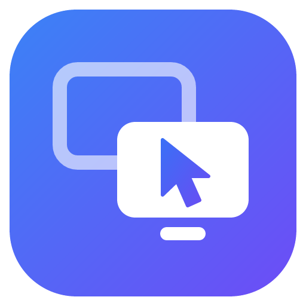

# PairDesk

**PairDesk** est un logiciel de contrôle à distance pair-à-pair, gratuit et sans limitation d'usage — une alternative à TeamViewer. Chaque ordinateur reçoit un **ID à 9 chiffres** et un **mot de passe** : votre partenaire vous les communique, vous vous connectez, vous voyez et contrôlez son écran.

<p align="center"></p>

## ⬇️ Télécharger

| Système | Lien (toujours la dernière version) |
|---|---|
| **Windows 10/11** | **[Télécharger PairDesk-Setup.exe](https://github.com/Azukkia/PairDesk/releases/latest/download/PairDesk-Setup.exe)** |
| Linux (AppImage) | [PairDesk-x86_64.AppImage](https://github.com/Azukkia/PairDesk/releases/latest/download/PairDesk-x86_64.AppImage) |
| Linux (Debian/Ubuntu) | [PairDesk-amd64.deb](https://github.com/Azukkia/PairDesk/releases/latest/download/PairDesk-amd64.deb) |
| **Android 8+** (téléphone, tablette) | *Bientôt (version 1.2.1)* : [PairDesk.apk](https://github.com/Azukkia/PairDesk/releases/latest/download/PairDesk.apk), ou le code QR qui apparaîtra alors sur l'accueil de PairDesk pour PC |

Ces liens sont permanents : ils pointent toujours vers la dernière version publiée. Toutes les versions restent disponibles sur la page [Releases](https://github.com/Azukkia/PairDesk/releases).

## Fonctionnalités

| | |
|---|---|
| **Contrôle à distance** | Image de l'écran en temps réel, souris (clics, molette, glisser), clavier (y compris AZERTY, touches mortes, AltGr), combinaisons spéciales (Alt+Tab, Win+R, Ctrl+Maj+Échap…), choix de l'écran si plusieurs moniteurs, plein écran, ajustement ou taille réelle, 3 niveaux de qualité. Le **curseur suit votre souris sans aucun retard** (c'est votre propre curseur, qui prend la forme de celui de l'ordinateur distant : flèche, texte, main…). |
| **Échanges** | **Copier-coller dans les deux sens** (Ctrl+C / Ctrl+V) : texte, texte mis en forme, images, fichiers et dossiers. **Glisser-déposer** un fichier dans la fenêtre de contrôle : il arrive à l'endroit où vous l'avez lâché (Bureau, dossier ouvert, application…). Transfert de fichiers par bouton (enregistrés dans `Téléchargements\PairDesk`), discussion instantanée, son de l'ordinateur distant (Windows). |
| **Téléphone Android** | Contrôlez votre PC depuis le téléphone, affichez et pilotez l'écran du téléphone sur le PC, ou **utilisez la caméra du téléphone comme webcam** du PC (« PairDesk Camera » dans Teams, Zoom, Discord, OBS, navigateurs…). |
| **Accès non surveillé** | Mot de passe personnel permanent + démarrage automatique avec Windows : connectez-vous à vos machines à tout moment. Mots de passe mémorisés par partenaire (chiffrés par Windows). |
| **Contrôle par l'utilisateur** | Panneau de session toujours visible sur l'ordinateur contrôlé (qui est connecté, durée, bouton « Terminer »), demande d'acceptation optionnelle, mode « affichage seul », réception de fichiers et presse-papiers désactivables. |
| **Mises à jour** | PairDesk vérifie au démarrage puis toutes les 4 heures si une nouvelle version existe, et **propose** de la télécharger puis de redémarrer pour l'installer. |
| **Sécurité** | Mot de passe vérifié par échange **PAKE (CPace)** — il ne circule jamais sur le réseau, même chiffré —, signalisation chiffrée (AES-256-GCM), flux pair-à-pair chiffré (WebRTC DTLS-SRTP), protection anti-force brute. |
| **Réseau** | Fonctionne sans aucune configuration (relais publics redondants pour la mise en relation), puis connexion **directe** entre les deux ordinateurs. Serveur privé et relais TURN optionnels. |
| **Langues** | Français et anglais (automatique selon Windows). Thème clair/sombre. |

## Installation (Windows 10/11)

1. Téléchargez **[PairDesk-Setup.exe](https://github.com/Azukkia/PairDesk/releases/latest/download/PairDesk-Setup.exe)** (ou une version précise depuis la page [Releases](https://github.com/Azukkia/PairDesk/releases)).
2. Lancez-le. Comme l'installeur n'est pas signé numériquement (un certificat de signature est payant), Windows SmartScreen peut afficher « Windows a protégé votre ordinateur » : cliquez sur **Informations complémentaires** puis **Exécuter quand même**.
3. Choisissez l'installation pour vous seul (recommandé, sans droits administrateur) ou pour tous les utilisateurs, puis terminez. Un raccourci est créé sur le Bureau et dans le menu Démarrer.

> Installez PairDesk sur **les deux** ordinateurs (celui qui contrôle et celui qui est contrôlé).

## Utilisation

**Pour être aidé (ordinateur contrôlé)** : ouvrez PairDesk et communiquez à votre partenaire votre **ID** et votre **mot de passe** (boutons de copie à côté). Pendant la session, un petit panneau reste affiché en bas à droite de l'écran : il indique qui est connecté et permet de **terminer la session** à tout moment.

**Pour aider (ordinateur qui contrôle)** : saisissez l'**ID du partenaire**, cliquez sur **Se connecter**, entrez son mot de passe. La fenêtre de contrôle s'ouvre : la barre d'outils permet de changer d'écran, la qualité, d'envoyer des combinaisons de touches, des fichiers, d'ouvrir la discussion, de passer en plein écran ou de se déconnecter.

**Accès non surveillé** : sur l'ordinateur distant, *Paramètres → Sécurité → Mot de passe personnel* et *Général → Démarrer PairDesk à l'ouverture de session*. Fermer la fenêtre laisse PairDesk actif dans la zone de notification (près de l'horloge).

Les connexions récentes apparaissent sur l'accueil et dans **Récents** ; cocher « Mémoriser le mot de passe » permet de se reconnecter en un clic. Un lien `pairdesk://123456789` ouvre directement une connexion.

## Sur votre téléphone Android

> L'application Android arrive avec la version 1.2.1. PairDesk pour PC 1.2.0 est déjà prêt à l'accueillir (sessions caméra, webcam « PairDesk Camera », téléphones contrôlés).

1. Sur le téléphone, ouvrez **[PairDesk.apk](https://github.com/Azukkia/PairDesk/releases/latest/download/PairDesk.apk)** (ou scannez le code QR de l'accueil de PairDesk sur le PC), puis ouvrez le fichier téléchargé. Android demande d'autoriser l'installation depuis le navigateur : acceptez (l'application n'est pas sur le Play Store).
2. L'application a, elle aussi, un **ID** et un **mot de passe**.

- **Contrôler le PC depuis le téléphone** : saisissez l'ID du PC et son mot de passe. Le doigt déplace la souris (mode pavé tactile ou toucher direct), le clavier du téléphone tape sur le PC, une barre de touches donne Échap, Tab, Ctrl, Alt, Windows, les flèches et les combinaisons.
- **Afficher le téléphone sur le PC** : sur le PC, connectez-vous à l'ID du téléphone. Le téléphone demande l'autorisation de partager son écran. Pour le **piloter** depuis le PC (souris, texte, boutons Retour / Accueil / Applications récentes de la barre d'outils), activez une fois le service d'accessibilité « PairDesk » proposé par l'application.
- **Caméra du téléphone comme webcam** : dans l'application, touchez **Caméra**, choisissez le PC (ID + mot de passe). Sur le PC, une fenêtre montre l'image ; sous Windows, la webcam **« PairDesk Camera »** apparaît dans Teams, Zoom, Discord, OBS, Chrome/Edge… (choisissez-la dans leurs réglages vidéo). Le bouton « Changer de caméra » passe de la caméra arrière à l'avant. La webcam est installée pour votre compte Windows seulement, sans droits administrateur, et retirée à la désinstallation de PairDesk.

## Mises à jour automatiques

Une fois installé, PairDesk interroge les [Releases GitHub](https://github.com/Azukkia/PairDesk/releases) de ce dépôt. Quand une version plus récente est publiée, une bannière **« La version X est disponible — Mettre à jour »** apparaît (et une notification Windows si la fenêtre est fermée). Après le téléchargement, **« Redémarrer et installer »** applique la mise à jour en quelques secondes. Rien n'est installé sans votre accord.

### Publier une nouvelle version

1. Modifiez le code, puis augmentez le numéro `"version"` dans `package.json` (ex. `1.0.0` → `1.0.1`).
2. Fusionnez dans la branche `main`.
3. Le workflow GitHub Actions **Release** construit l'installeur Windows (et les paquets Linux), crée la release `v1.0.1` et la publie. Tous les PairDesk installés proposeront la mise à jour à leur prochaine vérification.

Le workflow peut aussi être lancé à la main (onglet *Actions → Release → Run workflow*). Les fichiers d'une release ne sont jamais supprimés, et le lien [`releases/latest/download/PairDesk-Setup.exe`](https://github.com/Azukkia/PairDesk/releases/latest/download/PairDesk-Setup.exe) suit automatiquement la nouvelle version. (Chaque build de la CI fournit aussi l'installeur en artefact de test, conservé 90 jours.)

## Réseau et fiabilité

- **Mise en relation** : par défaut, les deux PairDesk se trouvent via plusieurs relais MQTT publics en parallèle (aucun serveur à installer). Ces relais ne voient que des messages chiffrés et ne peuvent ni lire la session, ni deviner le mot de passe, ni se faire passer pour votre partenaire.
- **Session** : l'image, la souris, le clavier et les fichiers passent **directement** d'un ordinateur à l'autre (WebRTC, traversée de NAT par STUN). La barre d'état de la fenêtre de contrôle indique « Direct (P2P) », le **délai estimé** entre les deux écrans (pastille verte/orange/rouge), le nombre d'images par seconde, le débit et le codec (survolez-la pour le détail).
- **Réseaux très restrictifs** (certaines entreprises, 4G/5G) : si la connexion directe est impossible, il faut un relais **TURN** — *Paramètres → Réseau → Relais TURN* (par exemple le TURN gratuit de Cloudflare, ou votre propre coturn).
- **Serveur privé (recommandé pour un usage intensif ou professionnel)** : les relais publics sont gérés par des tiers sans garantie de disponibilité. Vous pouvez héberger votre propre serveur PairDesk (une petite application Node.js, Docker fourni) qui fournit aussi des identifiants TURN : voir [`server/README.md`](server/README.md). Indiquez ensuite son adresse dans *Paramètres → Réseau → Serveur PairDesk privé* sur les deux ordinateurs, ou dans `pairdesk.config.json` (`defaultServerUrl`) pour qu'elle soit intégrée aux prochaines versions.

## Faible latence

PairDesk 1.1 réduit le délai de l'image de 1-2 s à quelques centaines de millisecondes, même sur une connexion lente :

- **Aucun tampon de lecture** côté contrôleur : chaque image est affichée dès qu'elle est décodée (au lieu d'attendre ~200 ms et plus quand le réseau varie).
- **Codec VP9** pour l'écran (texte net à 25-30 i/s là où VP8 tombait à 2-4 i/s), avec retour automatique à VP8 si l'ordinateur distant est trop lent pour l'encoder.
- **Résolution adaptative** : si le débit montant de l'ordinateur distant est faible, l'image est envoyée en résolution réduite (÷1,5 ou ÷2) plutôt que d'accumuler des secondes de retard, puis revient en pleine résolution dès que le réseau le permet.
- **Souris prioritaire** : les mouvements passent par un canal dédié sans retransmission (une position perdue est remplacée par la suivante, elle ne bloque jamais les autres), les clics et le clavier par un canal fiable ; les transferts de fichiers et le son ne peuvent plus retarder la souris ni l'image.

Mesures (ordinateur distant en 1080p, lien simulé) : avec 1,2 Mb/s en envoi, délai médian **617 → 217 ms** et 95ᵉ centile **1,6 s → 0,35 s** (1,7 → 26 images/s) ; avec 4 Mb/s, médian **417 → 184 ms**.

Les niveaux de qualité : *Vitesse optimisée* (le plus fluide, 60 i/s, résolution réduite), *Équilibrée* (par défaut : net et réactif) et *Qualité optimisée* (image la plus nette, pour les connexions rapides).

## Sécurité — comment ça marche

1. Le contrôleur et l'hôte dérivent chacun une valeur du mot de passe (PBKDF2, 200 000 itérations, salée par l'ID de l'hôte) puis exécutent **CPace** (PAKE sur ristretto255) : ils obtiennent une clé commune uniquement si le mot de passe est le bon. Un observateur ou un relais malveillant ne peut pas tester de mots de passe hors ligne ; un attaquant actif n'a droit qu'à **un essai par tentative**.
2. Après 5 échecs, l'ordinateur se verrouille temporairement (30 s, puis délai doublé à chaque nouvel échec, jusqu'à 30 min).
3. La clé de session chiffre et authentifie toute la signalisation (AES-256-GCM) — y compris l'empreinte DTLS de WebRTC, ce qui empêche toute interception de la connexion directe.
4. Le flux WebRTC est lui-même chiffré de bout en bout (DTLS-SRTP).
5. Le mot de passe personnel n'est jamais stocké en clair (seule sa valeur dérivée, chiffrée par le coffre de Windows/DPAPI).

## Limites connues

- **Écran sécurisé de Windows** : comme PairDesk fonctionne comme une application normale (et non comme un service système), il ne peut pas afficher ni contrôler les invites UAC « Voulez-vous autoriser… », l'écran de verrouillage ou Ctrl+Alt+Suppr. Pour contrôler des fenêtres lancées en administrateur, lancez PairDesk en administrateur sur l'ordinateur contrôlé.
- **Installeur non signé** : avertissement SmartScreen à la première installation (voir plus haut). Un certificat de signature (ou Azure Trusted Signing) peut être ajouté dans le workflow sans changer le code.
- **Linux** : fonctionne sous X11 (sous Wayland, seules les applications XWayland reçoivent le contrôle). **macOS** n'est pas encore pris en charge.
- **Webcam « PairDesk Camera »** : Windows uniquement. C'est une webcam DirectShow, visible par la grande majorité des applications (Teams, Zoom, Discord, OBS, navigateurs) ; l'application *Caméra* de Windows, qui n'utilise que Media Foundation, ne la voit pas. Sélectionnez-la dans l'application une fois la caméra du téléphone connectée.

## Développement

Prérequis : Node.js 22+.

```bash
npm install            # dépendances + binaire Electron
npm start              # lance PairDesk
npm test               # tests unitaires (crypto, signalisation, serveur, MQTT)
npm run test:e2e       # test complet : deux instances se connectent et se contrôlent
                       # (sous Linux : xvfb-run -a -s "-screen 0 1600x1000x24" npm run test:e2e)
npm run dist:win       # installeur Windows dans dist/ (sous Linux : nécessite wine + wine32)
npm run dist:linux     # AppImage + .deb
npm run icons          # régénère les icônes depuis assets/logo.svg
npm run build:camera   # Windows : webcam « PairDesk Camera » (CMake + Visual Studio C++)
```

Application Android (`android/`, Kotlin, JDK 17 + SDK Android) :

```bash
cd android
./gradlew :core:test        # protocole, cryptographie, interopérabilité avec le code de bureau
./gradlew :app:assembleDebug  # APK de test dans app/build/outputs/apk/debug/
```

Lancer deux instances sur la même machine : `npm start -- --pairdesk-profile=/tmp/profil-a` et `npm start -- --pairdesk-profile=/tmp/profil-b`.

### Organisation du code

```
src/main/        processus principal Electron
  main.js          démarrage, fenêtres, IPC, zone de notification
  network.js       transport de signalisation + mots de passe de l'hôte
  sessions.js      sessions entrantes/sortantes, injection des entrées
  signaling/       protocole de connexion (CPace, messages chiffrés), transports MQTT et WebSocket
  crypto/          CPace, canal AES-GCM, dérivation du mot de passe
  input/           injection souris/clavier (SendInput, XTest) et forme du curseur (GetCursorInfo, XFixes)
  cursor.js        suivi de la forme du curseur de l'hôte
  helper/          processus séparés : injection souris/clavier, alimentation de la webcam virtuelle
  camera/          webcam « PairDesk Camera » (inscription, images)
  clipboard*.js    copier-coller (texte, images, fichiers)
  drops.js         fichiers déposés à l'endroit visé sur l'écran distant
  updater.js       mises à jour automatiques (electron-updater)
src/renderer/    interfaces (HTML/CSS/JS sans framework)
  main/            fenêtre principale
  viewer/          fenêtre de contrôle (côté contrôleur)
  host/            panneau de session (côté ordinateur contrôlé)
  camera/          fenêtre de la caméra d'un téléphone
  common/          WebRTC, transferts de fichiers, chat, composants
src/shared/      code partagé (protocole, traductions, table des touches)
server/          serveur de signalisation optionnel (Node.js + Docker)
native/softcam/  filtre DirectShow de la webcam virtuelle (softcam, MIT)
android/         application Android (Kotlin)
docs/PROTOCOL.md protocole réseau complet (pour d'autres implémentations)
test/            tests unitaires et de bout en bout
```
